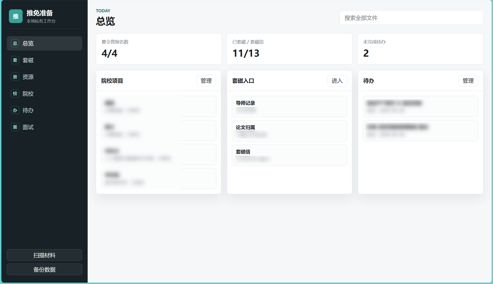
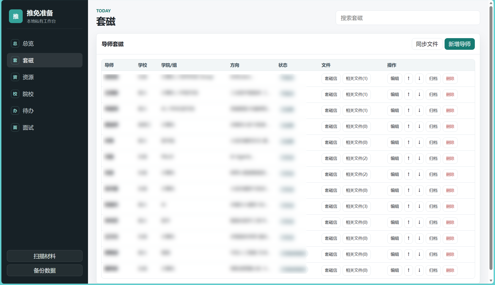
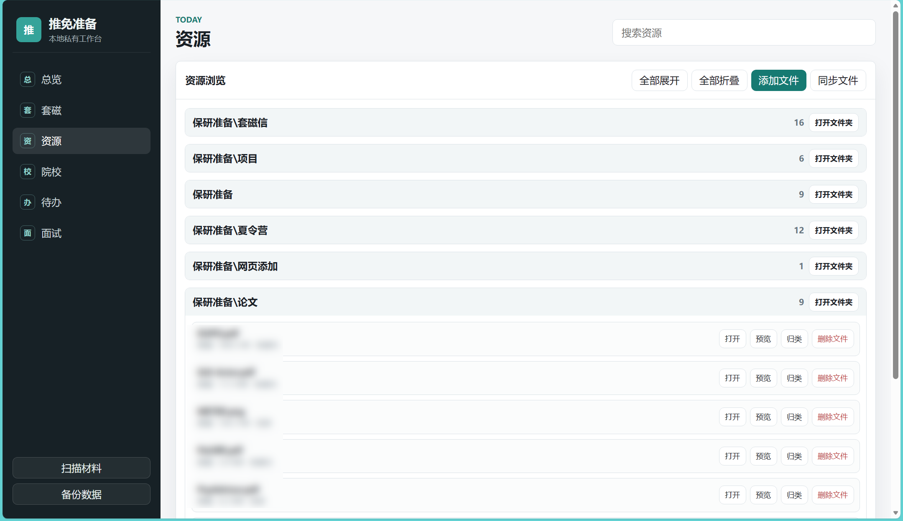
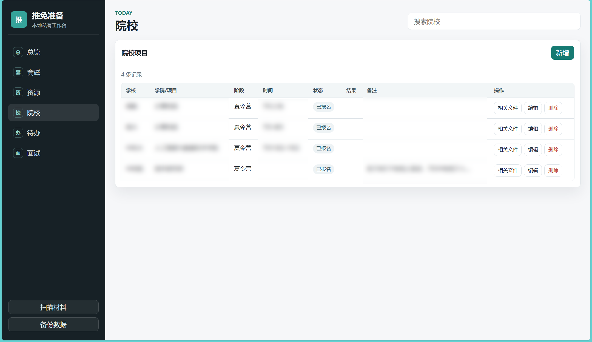
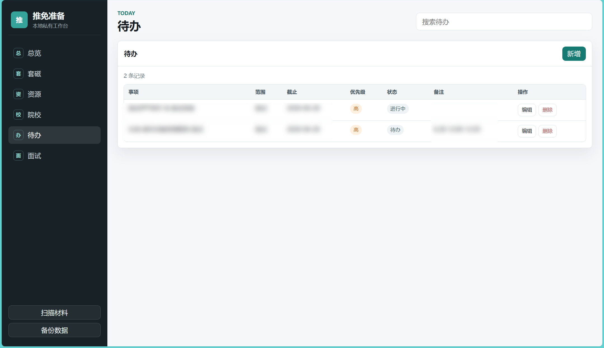
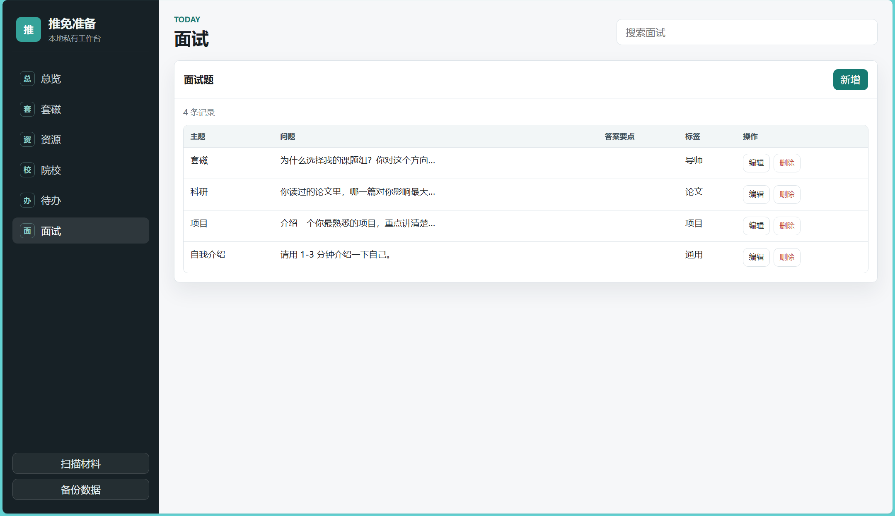

# 推免准备本地工作台

一个面向保研、推免、夏令营、预推免准备的本地私有网页。它把院校项目、导师套磁、材料文件、待办事项和面试题库集中到一个轻量工作台里，适合需要长期整理资料、快速打开本地文件、跟踪申请进度的同学。

系统默认运行在本机，个人资料和数据库不需要上传到云端。公开仓库只建议保存程序代码和已脱敏截图。

## 截图













## 适合谁

- 正在准备推免、保研、夏令营、预推免的学生。
- 需要同时管理多个院校项目、导师、套磁信和论文材料。
- 希望用一个本地网页统一读写表格信息，并快速打开本地 PDF、Word、Excel、图片等文件。
- 不想把简历、成绩单、证书、套磁信、导师论文等敏感资料放到在线系统。

## 功能

- 总览看板：统计夏令营报名、套磁进度和待办数量，快速进入关键模块。
- 院校项目管理：记录学校、学院或项目、阶段、时间、账号、状态、结果和备注。
- 导师套磁管理：每位导师一行，支持套磁信打开、相关文件查看、排序、归档和删除记录。
- 资源管理：按一级/二级文件夹浏览本地资料，支持搜索、上传、归类、备注、预览和删除文件。
- 文件关联：把文件归类到基本材料、套磁、院校、项目、面试、参考等类型，并关联到具体导师或院校。
- 待办事项：记录任务范围、截止时间、优先级、状态和备注。
- 面试题库：整理问题、答案要点、主题和标签。
- 本地备份：一键备份 SQLite 数据库。

## 技术栈

- 后端：Python 标准库 HTTP 服务
- 数据库：SQLite
- 前端：原生 HTML / CSS / JavaScript
- 运行方式：本地浏览器访问 `http://127.0.0.1:8848`

项目没有框架依赖，适合直接下载、修改和本地运行。

## 快速开始

确保已安装 Python 3。

```powershell
python app.py
```

然后在浏览器访问：

```text
http://127.0.0.1:8848
```

Windows 用户也可以双击：

```text
start.bat
```

如需更换端口，可以设置环境变量：

```powershell
$env:BAOYAN_PORT="8891"
python app.py
```

## 推荐目录结构

公开仓库建议只保留源码、README 和已脱敏截图：

```text
.
├─ app.py
├─ start.bat
├─ README.md
├─ PUBLIC_UPLOAD_CHECKLIST.md
├─ .gitignore
├─ web/
│  ├─ index.html
│  ├─ app.js
│  └─ style.css
└─ imgs/
   ├─ 总览页.png
   ├─ 套磁页.png
   ├─ 资源页.png
   ├─ 院校页.png
   ├─ 待办页.png
   └─ 面试页.png
```

本地运行后会自动使用或生成下面这些私有目录，它们不应提交到 GitHub：

```text
data/
├─ app.db
└─ backups/

保研准备/
└─ 网页添加/
```

建议把自己的材料放在 `保研准备/` 下，例如：

```text
保研准备/
├─ 基本材料/
├─ 套磁信/
├─ 论文/
├─ 院校项目/
├─ 夏令营/
├─ 面试/
└─ 网页添加/
```

你可以按自己的习惯调整本地材料目录。网页资源页会扫描本地文件，并按一级/二级文件夹展示。

## 使用建议

1. 将个人资料放在 `保研准备/` 下。
2. 在网页左侧点击“扫描材料”，同步本地文件索引。
3. 在资源页为文件设置归类：`基本材料`、`套磁`、`院校`、`项目`、`面试`、`参考`。
4. 归类为 `套磁` 时，可以选择关联导师；归类为 `院校` 时，可以选择关联院校。
5. 在套磁页使用“套磁信”和“相关文件”快速打开导师相关材料。
6. 在院校页使用“相关文件”快速查看某个院校项目的材料。
7. “打开”会调用本机默认程序打开文件。
8. “预览”只对 PDF、图片、文本等浏览器可直接查看的文件显示。
9. “删除文件”会删除本地文件，操作前请确认。
10. 经常点击“备份数据”，备份 SQLite 数据库。

## 隐私与公开上传

这个项目很适合开源代码，但不适合上传个人数据。提交前请确认：

- 不上传 `保研准备/`。
- 不上传 `data/`、`*.db`、数据库备份。
- 不上传简历、成绩单、证明、证书、套磁信、导师论文、申请表、账号截图等文件。
- 只上传已经脱敏的 `imgs/` 截图。
- 不要把整个项目文件夹压缩后直接上传。

推荐在提交前执行：

```powershell
git status --short
git status --ignored --short
git ls-files
```

更多检查步骤见 [PUBLIC_UPLOAD_CHECKLIST.md](PUBLIC_UPLOAD_CHECKLIST.md)。

## 可以直接使用原目录上传吗

可以，但风险比单独导出一个公开目录更高。若直接使用原目录，建议只执行精确添加：

```powershell
git add .gitignore README.md PUBLIC_UPLOAD_CHECKLIST.md app.py start.bat web imgs
```

不要在原目录里使用 `git add .`，除非你已经逐项确认没有任何个人资料会被提交。

## 仓库命名建议

推荐仓库名：

- `baoyan-workbench`
- `tuimian-workbench`
- `postgrad-recommendation-workbench`
- `baoyan-local-dashboard`
- `tuimian-application-manager`

推荐 GitHub 简介：

```text
一个本地运行的推免/保研准备工作台，用于管理院校项目、导师套磁、材料文件、待办事项和面试题库。
```

更偏英文受众可以用：

```text
A local-first dashboard for Chinese graduate recommendation preparation, covering programs, professors, documents, todos, and interview notes.
```
